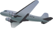

# Game Design Document
----

My game follows the adventure of a little pig who has learned how to fly. 
You control his flight with mouse clicks.
If you do not click on the Pig initially, the game will start but the pig will not move. This will be a very boring and very quick game. 
Rather, the way to play the game is by clicking on the Pig. The first click will start the pig moving upwards. To get the pig to move back downwards, click again. Etc. 

Your pig is not alone in the sky though. There are obstacles, which are the '5 things' which he is supposed to avoid or go towards. 

Here is an image of the pig 

## 5 things
----
`1.` **Apple** This will give the Player 100 extra points. 
`2.` **Airplane** The Airplane moves very quickly but only in the x direction. Avoid the Airplane or else lose a life. 
`3.` **Balloon** The Balloon's movement is slowly floating upwards and to the left. A collision withe Balloon will also lose a life. 
`4.` **Hot Air Balloon** Similar to the Balloon but opposite, the Hot Air Balloon's movement is from the top to downwards and right. Avoid the Hot Air Balloon. 
`5.` **Buildings** These are on the Bottom of the screen. Do not crash into the Buildings. 

## Score Changes 
----

The score increases proportionately with the distance that the pig has travelled. Apples can get also increase the score. 
The score never goes down, only increases. 

## Lives 
----

The pig starts off with 3 lives. Every time he crashes into an obstacle, he loses a life. The game immediately ends when all his lives are gone. 

## Layout 
----
[Link to basic sketch](https://imgur.com/qAVbxxc) 

